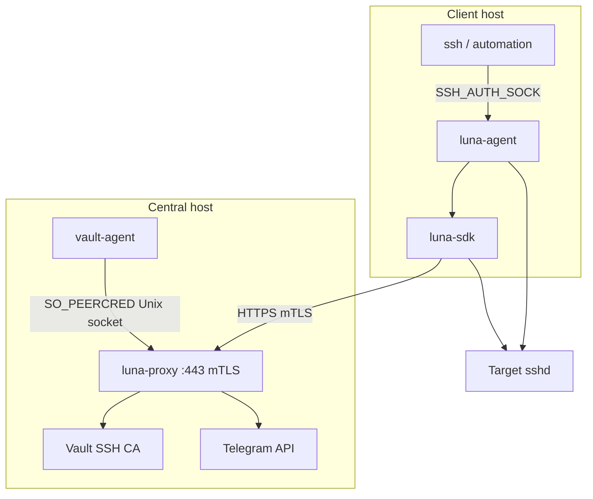

# Luna Z-Trust

Ephemeral SSH certificate authentication for AI agents, DevOps runners, and automation. Luna replaces long-lived SSH keys with short-lived certificates signed by a HashiCorp Vault SSH CA, gated by out-of-band human approval (Telegram) and strict client authentication (mTLS, proof-of-possession, request HMAC).

## Components

| Component | Role |
|-----------|------|
| **luna-sdk** | Publishable Go library: ephemeral keys, PoP, mTLS + HMAC to proxy, cert lifecycle |
| **luna-proxy** | Central gateway: authorization, Telegram OOB approval, Vault SSH CA signing |
| **luna-agent** | OS daemon: `SSH_AUTH_SOCK` interceptor; blocking `Sign` for unmodified `ssh` |

**Out of scope in this repository:** [lunacli](https://github.com/ba0f3/lunacli) (separate project; imports `luna-sdk`), `vault-agent`, Vault server provisioning, target `sshd` setup.

## Architecture



**Sign flow (transaction + wait):**

1. Client generates an ephemeral Ed25519 keypair (memory only).
2. `POST /api/v1/ssh/sign` with JSON body, `pop_signature`, mTLS, `X-Luna-Body-Mac`.
3. Proxy validates the auth pipeline, creates `tx_id`, sends Telegram (or auto-approves in dev).
4. `GET /api/v1/ssh/sign/{tx_id}/wait` blocks until approved, denied, or timeout.
5. Proxy obtains a Vault token via vault-agent, signs the cert with `source-address` from client IP.
6. SDK returns `*ssh.Certificate` + private key; agent returns `ssh.Signature` to OpenSSH.

## Repository layout

```
luna-ztrust/
  go.work
  sdk/          # github.com/ba0f3/luna-ztrust/sdk
  proxy/        # github.com/ba0f3/luna-ztrust/proxy
  agent/        # github.com/ba0f3/luna-ztrust/agent
  docs/
    design-specification.md
    superpowers/specs/2026-05-21-luna-core-design.md
    superpowers/plans/2026-05-21-luna-core.md
```

**Module dependency rules:**

- `agent` → `sdk`
- `proxy` does not import `sdk`
- `sdk` does not import `agent` or `proxy`

## Requirements

- Go 1.23+
- Linux (for `SO_PEERCRED` vault-agent token handoff on the proxy host)
- Internal mTLS CA (client certs for SDK/agent)
- HashiCorp Vault with SSH secrets engine
- vault-agent on the proxy host
- Telegram bot (production approval path)

## Build and test

```bash
go work sync
make test
```

Generate test mTLS material (when `scripts/gen-test-ca.sh` is present):

```bash
make testdata
```

## Configuration (overview)

### luna-proxy

| Variable | Purpose |
|----------|---------|
| `LUNA_ENV=dev` | Auto-approve (proxy only; not client-settable) |
| `VAULT_AGENT_SOCKET` | Unix path for Vault token handoff |
| `TELEGRAM_BOT_TOKEN` | Outbound Telegram API |
| `TELEGRAM_WEBHOOK_SECRET` | Webhook validation (`X-Telegram-Bot-Api-Secret-Token`) |
| `TELEGRAM_CHAT_ID` | Admin chat for approval prompts |

### luna-agent

| Variable | Purpose |
|----------|---------|
| `LUNA_PROXY_URL` | Proxy base URL |
| `LUNA_MTLS_CERT` / `LUNA_MTLS_KEY` / `LUNA_MTLS_CA` | Client mTLS material |
| `LUNA_TARGET_USER` | Default SSH principal |
| `LUNA_TARGET_HOST` | Target IP/hostname for cert binding |

Agent socket: `/run/luna/agent.sock` (mode `0600`).

## HTTP API

| Method | Path | Description |
|--------|------|-------------|
| `POST` | `/api/v1/ssh/sign` | Create transaction; `202` + `tx_id` |
| `GET` | `/api/v1/ssh/sign/{tx_id}/wait` | Block until cert or terminal error |
| `POST` | `/api/v1/telegram/webhook` | Telegram approval callback |
| `GET` | `/healthz` | Health check (no auth) |

Auth order on sign requests: mTLS → HMAC (`X-Luna-Body-Mac` via TLS exporter `luna-request-hmac`) → timestamp window → replay LRU → PoP signature.

## Security principles

- **Fail-closed:** Auth failures never create transactions or Telegram prompts.
- **Zero disk keys:** Ephemeral private keys and certs stay in memory (v1).
- **IP binding:** Vault `source-address` from client `RemoteAddr` on the mTLS listener.
- **No static HMAC secret:** Derived from TLS exporter after handshake.
- **Privilege separation:** vault-agent (root) hands tokens to luna-proxy (dedicated user) via SO_PEERCRED.

## Documentation

| Document | Contents |
|----------|----------|
| [docs/design-specification.md](docs/design-specification.md) | North-star system design (Vault phases, zero-disk keys, lunacli) |
| [docs/superpowers/specs/2026-05-21-luna-core-design.md](docs/superpowers/specs/2026-05-21-luna-core-design.md) | Approved design for sdk, proxy, agent |
| [docs/superpowers/plans/2026-05-21-luna-core.md](docs/superpowers/plans/2026-05-21-luna-core.md) | Phased implementation plan |
| [AGENTS.md](AGENTS.md) | Guidance for AI coding agents |

## Status

Early scaffold: Go workspace and module stubs exist; core signing, auth pipeline, and agent protocol are specified and tracked in the implementation plan. See the plan for phase exit criteria (P0–P5).

## License

See repository license file when published.
