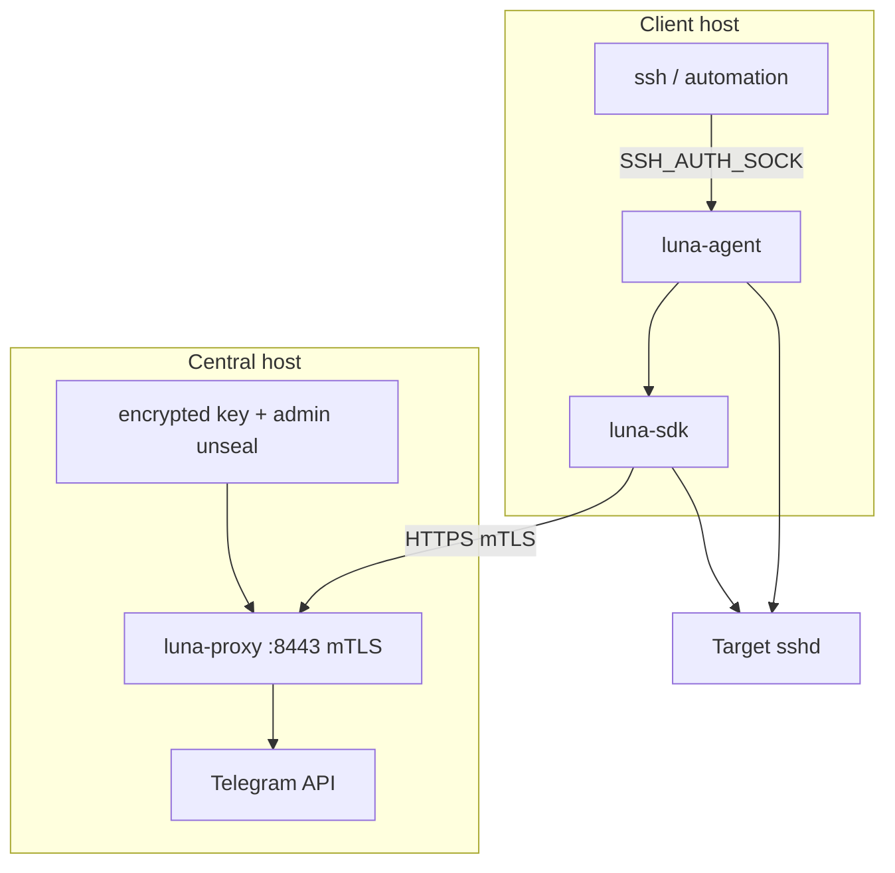

# Luna Z-Trust

Ephemeral SSH authentication for AI agents, DevOps runners, and automation. A self-hosted **luna-proxy** holds encrypted signing keys (manual unseal), issues short-lived SSH **certificates** (`local-ca`) or **hosted-key signatures** (`local-key`), and gates access with out-of-band approval (Telegram v1; mobile enroll/approve API on the server).

## Components

| Component | Role |
|-----------|------|
| **luna-sdk** | Publishable Go library: ephemeral keys, PoP, mTLS + HMAC to proxy, cert/signature lifecycle |
| **luna-proxy** | Central gateway: auth pipeline, keystore unseal, signing, Telegram OOB, session leases |
| **luna-agent** | OS daemon: `SSH_AUTH_SOCK` interceptor; blocking `Sign` for unmodified `ssh` |

**Out of scope in this repository:** [lunacli](https://github.com/ba0f3/lunacli) (separate project; imports `luna-sdk`), target `sshd` provisioning.

## Architecture



**Sign flow (transaction + wait):**

1. Client generates an ephemeral Ed25519 keypair (memory only).
2. `POST /api/v1/ssh/sign` with JSON body, `pop_signature`, mTLS, `X-Luna-Body-Mac`.
3. Proxy validates the auth pipeline; if the keystore is sealed → `503`. Otherwise lease fast-path or new `tx_id` + Telegram (or auto-approve in dev).
4. `GET /api/v1/ssh/sign/{tx_id}/wait` blocks until approved, denied, or timeout.
5. Proxy signs via `local-ca` (SSH user cert + `source-address`) or `local-key` (`agent_sign_data` → `ssh_signature`).
6. SDK returns cert + private key, or signature; agent returns `ssh.Signature` to OpenSSH.

## Repository layout

```
luna-ztrust/
  go.work
  sdk/          # github.com/ba0f3/luna-ztrust/sdk
  proxy/        # github.com/ba0f3/luna-ztrust/proxy
  agent/        # github.com/ba0f3/luna-ztrust/agent
  docs/
    superpowers/specs/2026-05-30-self-hosted-central-design.md
    superpowers/plans/2026-05-30-self-hosted-central.md
```

**Module dependency rules:**

- `agent` → `sdk`
- `proxy` does not import `sdk`
- `sdk` does not import `agent` or `proxy`

## Requirements

- Go 1.25+ (see `go.work`)
- Linux recommended (keystore `mlock` on unseal)
- Internal mTLS CA (client certs for SDK/agent; admin OU for unseal API)
- Encrypted signing key at `LUNA_KEY_PATH`
- Telegram bot (production approval path)

## Build and test

```bash
go work sync
make test
make testdata   # mTLS + encrypted SSH keys for CI
make build      # bin/luna-proxy, bin/luna-agent
make ci         # fmt-check, lint, test, build (local CI parity)
```

**CI:** GitHub Actions runs `make ci` on push/PR and Docker E2E (`make e2e-up`, `e2e-wait`, `e2e-test`) in [`.github/workflows/ci.yml`](.github/workflows/ci.yml).

**Releases:** Tag `v*` (e.g. `v0.1.0`) triggers [GoReleaser](.goreleaser.yaml) via [`.github/workflows/release.yml`](.github/workflows/release.yml) — cross-platform `luna-proxy` and `luna-agent` archives plus checksums on GitHub Releases.

## E2E

Docker Compose runs `luna-proxy` with test mTLS and an encrypted CA key. Tests call `POST /api/v1/admin/unseal` before signing.

```bash
make testdata
make e2e-up
make e2e-test
make e2e-down
```

```bash
LUNA_PROXY_URL=https://localhost:8443 go test -tags=e2e ./sdk/sign/... -v
```

## Configuration (overview)

### luna-proxy

| Variable | Purpose |
|----------|---------|
| `LUNA_KEY_PATH` | Encrypted SSH signing key (PEM, passphrase at unseal) |
| `LUNA_SIGNER_MODE` | `local-ca` (default) or `local-key` |
| `LUNA_ADMIN_CLIENT_OU` | Client cert OU for `/api/v1/admin/*` (default `luna-admin`) |
| `LUNA_CLI_CLIENT_OU` | Client cert OU for enrolled CLI devices (default `luna-cli`) |
| `LUNA_MTLS_CA_CERT` | mTLS issuing CA cert path (CSR enrollment for CLI devices) |
| `LUNA_MTLS_CA_KEY` | mTLS issuing CA key path (0400; required for `cli enroll`) |
| `LUNA_ENV=dev` | Auto-approve (proxy env only) |
| `TELEGRAM_BOT_TOKEN` | Outbound Telegram API |
| `TELEGRAM_WEBHOOK_SECRET` | Webhook validation |
| `TELEGRAM_CHAT_ID` | Admin chat for approval prompts |
| `FCM_CREDENTIALS` | P5 hook for mobile push (stub until implemented) |

Vault / `LUNA_VAULT_*` are removed from the runtime path; see [docs/legacy-vault-migration.md](docs/legacy-vault-migration.md).

### Remote key load (`local-key`)

When `signer_mode=local-key`, operators can load host signing keys without copying encrypted PEM to the central host. On-host load still uses the control socket (`luna-proxy key load /path/on/server` on the central machine). From a laptop, use enrolled CLI mTLS (`OU=luna-cli`).

**1. Enroll a CLI device (CSR; private key never leaves the laptop)**

```bash
luna-proxy cli init                    # ~/.config/luna/cli.key
luna-proxy cli csr                     # ~/.config/luna/cli.csr.pem
# On central host (admin control socket or admin mTLS):
luna-proxy cli enroll --label alice-macbook --csr-file ~/.config/luna/cli.csr.pem
# Writes cli.crt beside the CSR (or use --cert-out)
```

The proxy must have `mtls_ca_cert_path` / `mtls_ca_key_path` set (or `LUNA_MTLS_CA_CERT` / `LUNA_MTLS_CA_KEY`). Without CA key material, enroll returns `503`.

**2. Configure the operator profile**

`~/.config/luna/cli.yaml`:

```yaml
proxy_url: https://luna.example:443
cli_cert: ~/.config/luna/cli.crt
cli_key: ~/.config/luna/cli.key
ca: ~/.config/luna/ca.crt
```

Flags override the file: `--proxy-url`, `--cli-cert`, `--cli-key`, `--ca`.

**3. Load from the laptop**

```bash
luna-proxy key load ./encrypted-host.key --label deploy-prod
```

Uploads base64 encrypted PEM + passphrase over `POST /api/v1/cli/keys/load` inside mTLS. Requires `--label` for remote load. Keystore must be unsealed on the proxy.

**v1 notes:** CLI device registry is in-memory; proxy restart drops enrollments (re-enroll and re-load). Mobile pending upload + `key confirm` is unchanged.

See [docs/superpowers/specs/2026-05-31-cli-remote-key-load-design.md](docs/superpowers/specs/2026-05-31-cli-remote-key-load-design.md).

### luna-agent

| Variable | Purpose |
|----------|---------|
| `LUNA_PROXY_URL` | Proxy base URL |
| `LUNA_SIGNER_MODE` | `local-ca` or `local-key` (must match proxy) |
| `LUNA_MTLS_CERT` / `LUNA_MTLS_KEY` / `LUNA_MTLS_CA` | Client mTLS material |
| `LUNA_TARGET_USER` | Default SSH principal |
| `LUNA_TARGET_HOST` | Target IP/hostname for PoP / cert binding |

Agent socket: `/run/luna/agent.sock` (mode `0600`).

## HTTP API

| Method | Path | Description |
|--------|------|-------------|
| `POST` | `/api/v1/admin/unseal` | Admin mTLS: load signing key |
| `GET` | `/api/v1/admin/seal-status` | Admin mTLS: sealed state |
| `GET` | `/api/v1/capabilities` | mTLS: signer mode, TTLs, sealed |
| `POST` | `/api/v1/ssh/sign` | Create transaction; `202` + `tx_id` |
| `GET` | `/api/v1/ssh/sign/{tx_id}/wait` | Block until cert/signature or error |
| `POST` | `/api/v1/telegram/webhook` | Telegram approval callback |
| `POST` | `/api/v1/mobile/enroll` | Admin mTLS: register device |
| `POST` | `/api/v1/mobile/approve` | mTLS + device signature |
| `DELETE` | `/api/v1/mobile/devices/{device_id}` | Admin mTLS: revoke device |
| `POST` | `/api/v1/cli/enroll` | Admin mTLS: sign CSR, register CLI device |
| `GET` | `/api/v1/cli/devices` | Admin mTLS: list CLI devices |
| `DELETE` | `/api/v1/cli/devices/{device_id}` | Admin mTLS: revoke CLI device |
| `POST` | `/api/v1/cli/keys/load` | Enrolled CLI mTLS: upload encrypted key (`local-key` only) |
| `GET` | `/healthz` | Health check (no client cert required) |

Auth order on sign requests: mTLS → HMAC → timestamp → replay LRU → PoP → tx/lease/sign.

## Security principles

- **Fail-closed:** Auth and unseal failures never create transactions or Telegram prompts.
- **Sealed by default:** Sign returns `503` until admin unseal.
- **Zero disk keys on clients:** Ephemeral private keys stay in memory.
- **IP binding:** `source-address` on user certs from mTLS `RemoteAddr`.
- **Session leases:** Re-approval skipped for same client + target + approver within TTL.

## Documentation

| Document | Contents |
|----------|----------|
| [docs/setup.md](docs/setup.md) | Target `sshd` trust, unseal runbook, legacy Vault notes |
| [docs/legacy-vault-migration.md](docs/legacy-vault-migration.md) | Vault → self-hosted mapping |
| [docs/superpowers/specs/2026-05-30-self-hosted-central-design.md](docs/superpowers/specs/2026-05-30-self-hosted-central-design.md) | Self-hosted central server design |
| [docs/superpowers/plans/2026-05-30-self-hosted-central.md](docs/superpowers/plans/2026-05-30-self-hosted-central.md) | Implementation plan |
| [AGENTS.md](AGENTS.md) | Guidance for AI coding agents |

## License

See repository license file when published.
