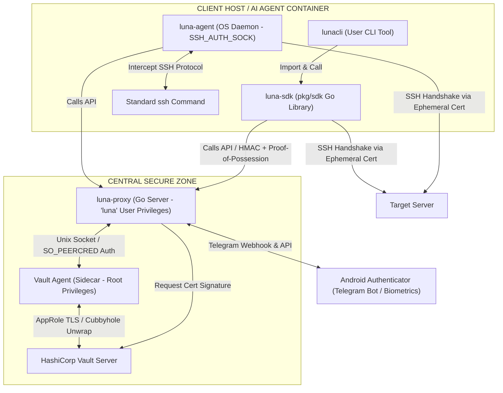

# LUNA SYSTEM DESIGN SPECIFICATION (Z-TRUST SSH AUTHENTICATION ENGINE)

This technical specification document defines the system architecture, Zero-Trust security principles, and standardized Go structures for the Out-of-Band (OOB) remote SSH authentication system. This architecture is designed for AI Agents, DevOps Runners, and remote execution tools (lunacli).

---

## I. SYSTEM ARCHITECTURE

The system is engineered around the principle of privilege separation, ephemeral SSH Certificate-based identity instead of static keys, and the complete elimination of static credentials stored on disk.



### 1. Component Responsibilities

* vault-agent (Auto-Auth): Runs as a high-privilege system daemon (root). Authenticates the host's machine identity against the central Vault Server and manages the lifecycles of short-lived tokens.
* luna-proxy: The central gateway of the control plane. It holds no persistent secrets. It reads Vault tokens from vault-agent over a local IPC socket secured by strict UID enforcement. It coordinates OOB approvals with the Android Authenticator via Telegram and requests signatures from the Vault SSH CA.
* luna-sdk: A pure Go library (pkg/sdk). It runs entirely in-memory with zero disk footprint. It generates ephemeral Ed25519 keys, compiles cryptographic Proof-of-Possession (PoP) payloads to authenticate requests with the Proxy, retrieves the signed SSH certificate, and manages the raw SSH connection.
* luna-agent: A lightweight OS daemon mimicking an SSH Agent socket. It listens on SSH_AUTH_SOCK and intercepts signature requests from standard SSH CLI binaries. It transparently routes approvals via the central proxy and returns signed certs to the OpenSSH execution pipeline.
* lunacli: The end-user command-line application that integrates luna-sdk to execute high-level tasks like remote command execution (exec) and secure file transfers (sftp).

---

## II. ZERO-TRUST SECURITY & DEFENSIVE MODEL

### 1. Safe AppRole Introduction via Vault Response Wrapping

To kickstart vault-agent on traditional bare-metal environments without exposing a long-lived, high-value static secret (SecretID):

* The provisioning engine generates a wrapped SecretID with a very short TTL (30s) and a strict single-use constraint (max_use=1).
* This wrapping token is delivered to the target server.
* On boot, vault-agent unwraps this token to ingest the actual SecretID directly into memory, rendering the on-disk token useless immediately.
* Tamper Detection: If a malicious process intercepts and unwraps the token before vault-agent does, vault-agent will fail to start and trigger an alert, alerting administrators that the deployment vector was compromised.

### 2. Proof-of-Possession (PoP) at the SDK Layer

This mitigates Man-in-the-Middle (MitM) attacks where an attacker intercepts a signature request on the wire and attempts to substitute their own public key for the Vault CA to sign.

* When luna-sdk generates a transient keypair in memory, it does not send the raw public key to the proxy in plain text.
* The SDK hashes a challenge payload consisting of (TargetIP + TargetUser + UnixTimestamp) and signs it with the newly generated Private Key.
* luna-proxy verifies this PoP signature using the client's public key. The proxy only proceeds to interact with the Vault SSH CA once it verifies that the client has actual possession of the corresponding private key.

### 3. Unix Domain Socket Enforcement via SO_PEERCRED

This blocks local privilege escalation, preventing other unprivileged local users or malicious processes on the proxy host from hijacking the internal communication socket.

* The IPC socket between vault-agent and luna-proxy utilizes the Linux kernel's SO_PEERCRED socket option.
* During the handshake, the socket interface fetches the calling process's identity credentials: UID, GID, and PID.
* The server drops connections instantly if the caller's UID does not match the dedicated unprivileged system user assigned to luna-proxy (uid=1001 for the luna service user).

### 4. Zero-Disk In-Memory Keys

* Private keys and temporary SSH certificates are never written to the file system (e.g., /tmp), preventing disk-scraping malware from capturing them.
* The luna-sdk leverages Go's native SSH client configuration by parsing private key objects directly in RAM. If standard shell processes must be spawned, the SDK uses the Linux memfd_create system call to allocate a secure anonymous file descriptor in RAM and passes it as /proc/self/fd/<fd_num> to the target command.

### 5. Blast Radius Control: IP Constraints in SSH Certificates

* When luna-proxy requests a certificate from the Vault CA, it inspects the client's incoming network packet, extracts the source IP address, and hardcodes it into the source-address critical option of the SSH certificate.
* Even if an attacker somehow exfiltrates this signed certificate, the target server's SSH daemon (sshd) will immediately reject connections originating from any other IP.

---

## III. CONFIGURATION & CODE SPECIFICATIONS

### 1. Vault Agent Auto-Auth Configuration (vault-agent.hcl)

```hcl
pid_file = "/var/run/vault-agent.pid"

vault {
  address = "[https://vault.internal.local:8200](https://vault.internal.local:8200)"
  tls_skip_verify = false
  tls_ca_file = "/etc/ssl/certs/internal-ca.pem"
}

auto_auth {
  method "approle" {
    config = {
      role_id_file_path   = "/etc/vault/role-id"
      secret_id_file_path = "/etc/vault/wrapped-secret-id"
      remove_secret_id_file_after_reading = true
    }
  }

  sink "file" {
    config = {
      path = "/dev/shm/vault-token"
    }
  }
}

```

---

### 2. Central Gateway Server Component (luna-proxy.go)

```go
package main

import (
	"bytes"
	"crypto/ed25519"
	"encoding/hex"
	"encoding/json"
	"fmt"
	"log"
	"net"
	"net/http"
	"os"
	"sync"
	"syscall"
	"time"

	"golang.org/x/crypto/ssh"
)

const (
	VaultAddr      = "[https://vault.internal.local:8200](https://vault.internal.local:8200)"
	VaultTokenPath = "/dev/shm/vault-token"
	ListenPort     = ":8080"
)

type SSHSignRequest struct {
	PublicKey   string `json:"public_key"`
	TargetUser  string `json:"target_user"`
	TargetIP    string `json:"target_ip"`
	Timestamp   int64  `json:"timestamp"`
	Signature   string `json:"signature"`
}

type ProxyServer struct {
	activeTxs sync.Map
}

func main() {
	proxy := &ProxyServer{}
	http.HandleFunc("/api/v1/ssh/sign", proxy.handleSignRequest)
	
	log.Printf("[LUNA-PROXY] Listening on %s...", ListenPort)
	if err := http.ListenAndServe(ListenPort, nil); err != nil {
		log.Fatalf("Server startup failed: %v", err)
	}
}

func (p *ProxyServer) handleSignRequest(w http.ResponseWriter, r *http.Request) {
	if r.Method != http.MethodPost {
		http.Error(w, "Method not allowed", http.StatusMethodNotAllowed)
		return
	}

	var req SSHSignRequest
	if err := json.NewDecoder(r.Body).Decode(&req); err != nil {
		http.Error(w, "Bad request payload", http.StatusBadRequest)
		return
	}

	now := time.Now().Unix()
	if req.Timestamp < now-30 || req.Timestamp > now+30 {
		http.Error(w, "Request timestamp expired", http.StatusForbidden)
		return
	}

	pubKey, _, _, _, err := ssh.ParseAuthorizedKey([]byte(req.PublicKey))
	if err != nil {
		http.Error(w, "Invalid public key format", http.StatusBadRequest)
		return
	}

	msg := fmt.Sprintf("%s:%s:%d", req.TargetUser, req.TargetIP, req.Timestamp)
	sigBytes, err := hex.DecodeString(req.Signature)
	if err != nil {
		http.Error(w, "Invalid signature hex", http.StatusBadRequest)
		return
	}

	sshSig := &ssh.Signature{Format: pubKey.Type(), Blob: sigBytes}
	if err := pubKey.Verify([]byte(msg), sshSig); err != nil {
		http.Error(w, "Proof-of-Possession failed", http.StatusUnauthorized)
		return
	}

	txID := fmt.Sprintf("tx_%d", req.Timestamp)
	approveChan := make(chan bool, 1)
	p.activeTxs.Store(txID, approveChan)
	defer p.activeTxs.Delete(txID)

	select {
	case approved := <-approveChan:
		if !approved {
			http.Error(w, "Rejected by administrator", http.StatusForbidden)
			return
		}
	case <-time.After(60 * time.Second):
		http.Error(w, "Approval timed out", http.StatusRequestTimeout)
		return
	}

	token, err := os.ReadFile(VaultTokenPath)
	if err != nil {
		http.Error(w, "Internal token read error", http.StatusInternalServerError)
		return
	}

	signedCert, err := p.signSSHKeyWithVault(string(token), req.PublicKey, req.TargetUser, r.RemoteAddr)
	if err != nil {
		http.Error(w, fmt.Sprintf("Vault signing error: %v", err), http.StatusInternalServerError)
		return
	}

	w.Header().Set("Content-Type", "application/json")
	json.NewEncoder(w).Encode(map[string]string{"ssh_certificate": signedCert})
}

func (p *ProxyServer) signSSHKeyWithVault(token, pubKeyStr, username, remoteAddr string) (string, error) {
	host, _, _ := net.SplitHostPort(remoteAddr)
	vaultURL := fmt.Sprintf("%s/v1/ssh-agent-signer/sign/agent-role", VaultAddr)
	
	payload := map[string]interface{}{
		"public_key":       pubKeyStr,
		"valid_principals": username,
		"critical_options": map[string]string{"source-address": host},
	}

	body, _ := json.Marshal(payload)
	req, _ := http.NewRequest("POST", vaultURL, bytes.NewReader(body))
	req.Header.Set("X-Vault-Token", token)
	req.Header.Set("Content-Type", "application/json")

	client := &http.Client{Timeout: 10 * time.Second}
	resp, err := client.Do(req)
	if err != nil {
		return "", err
	}
	defer resp.Body.Close()

	var vaultResp struct {
		Data struct {
			SignedKey string `json:"signed_key"`
		} `json:"data"`
	}
	json.NewDecoder(resp.Body).Decode(&vaultResp)
	return vaultResp.Data.SignedKey, nil
}

func (p *ProxyServer) handleTelegramWebhook(w http.ResponseWriter, r *http.Request) {}

```

---

### 3. Client Library Component (pkg/sdk/client.go)

```go
package sdk

import (
	"bytes"
	"crypto/ed25519"
	"crypto/rand"
	"encoding/hex"
	"encoding/json"
	"fmt"
	"net/http"
	"time"

	"golang.org/x/crypto/ssh"
)

type Config struct {
	ProxyURL string
	APIKey   string
}

type LunaClient struct {
	cfg *Config
}

func NewClient(cfg *Config) *LunaClient {
	return &LunaClient{cfg: cfg}
}

func (c *LunaClient) ExecuteRemote(targetHost, targetUser, command string) ([]byte, error) {
	pubKey, privKey, err := ed25519.GenerateKey(rand.Reader)
	if err != nil {
		return nil, fmt.Errorf("in-memory key generation failed: %w", err)
	}

	sshPub, _ := ssh.NewPublicKey(pubKey)
	pubKeyBytes := ssh.MarshalAuthorizedKey(sshPub)

	timestamp := time.Now().Unix()
	challengeMsg := fmt.Sprintf("%s:%s:%d", targetUser, targetHost, timestamp)
	sigBytes := ed25519.Sign(privKey, []byte(challengeMsg))
	sigHex := hex.EncodeToString(sigBytes)

	certBytes, err := c.requestCertFromProxy(pubKeyBytes, sigHex, targetUser, targetHost, timestamp)
	if err != nil {
		return nil, err
	}

	signer, _ := ssh.ParsePrivateKey(privKey)
	pubCert, _, _, _, _ := ssh.ParseAuthorizedKey(certBytes)
	cert := pubCert.(*ssh.Certificate)

	certSigner, _ := ssh.NewCertSigner(cert, signer)
	sshConfig := &ssh.ClientConfig{
		User:            targetUser,
		Auth:            []ssh.AuthMethod{ssh.PublicKeys(certSigner)},
		HostKeyCallback: ssh.InsecureIgnoreHostKey(),
		Timeout:         15 * time.Second,
	}

	client, err := ssh.Dial("tcp", targetHost+":22", sshConfig)
	if err != nil {
		return nil, err
	}
	defer client.Close()

	session, _ := client.NewSession()
	defer session.Close()

	return session.CombinedOutput(command)
}

func (c *LunaClient) requestCertFromProxy(pubKey []byte, sigHex, user, host string, ts int64) ([]byte, error) {
	apiURL := fmt.Sprintf("%s/api/v1/ssh/sign", c.cfg.ProxyURL)
	payload := map[string]interface{}{
		"public_key": string(pubKey), "target_user": user, "target_ip": host, "timestamp": ts, "signature": sigHex,
	}

	body, _ := json.Marshal(payload)
	req, _ := http.NewRequest("POST", apiURL, bytes.NewBuffer(body))
	req.Header.Set("Content-Type", "application/json")
	req.Header.Set("X-API-Key", c.cfg.APIKey)

	client := &http.Client{Timeout: 70 * time.Second}
	resp, err := client.Do(req)
	if err != nil {
		return nil, err
	}
	defer resp.Body.Close()

	var res struct{ SSHCertificate string `json:"ssh_certificate"` }
	json.NewDecoder(resp.Body).Decode(&res)
	return []byte(res.SSHCertificate), nil
}

```

---

### 4. SSH Socket Interceptor Daemon (luna-agent.go)

```go
package main

import (
	"fmt"
	"log"
	"net"
	"os"
	"os/signal"
	"syscall"

	"golang.org/x/crypto/ssh"
	"golang.org/x/crypto/ssh/agent"
)

const SocketPath = "/tmp/luna-agent.sock"

type LunaSSHAgent struct {
	proxyURL string
	apiKey   string
}

func main() {
	_ = os.Remove(SocketPath)
	listener, err := net.Listen("unix", SocketPath)
	if err != nil {
		log.Fatalf("Socket listen failed: %v", err)
	}
	defer os.Remove(SocketPath)
	_ = os.Chmod(SocketPath, 0600)

	log.Printf("[LUNA-AGENT] Daemon active at %s", SocketPath)

	sigChan := make(chan os.Signal, 1)
	signal.Notify(sigChan, syscall.SIGINT, syscall.SIGTERM)
	go func() {
		<-sigChan
		os.Remove(SocketPath)
		os.Exit(0)
	}()

	lunaAgent := &LunaSSHAgent{
		proxyURL: "[http://luna-proxy.internal.local:8080](http://luna-proxy.internal.local:8080)",
		apiKey:   "AIAgentSuperSecretAPIKey",
	}

	for {
		conn, err := listener.Accept()
		if err != nil {
			continue
		}
		go lunaAgent.handleSSHAgentConnection(conn)
	}
}

func (la *LunaSSHAgent) handleSSHAgentConnection(c net.Conn) {
	defer c.Close()
	mockAgent := &customAgentWrapper{la: la}
	agent.ServeAgent(mockAgent, c)
}

type customAgentWrapper struct {
	la *LunaSSHAgent
}

func (a *customAgentWrapper) List() ([]*agent.Key, error) {
	return []*agent.Key{}, nil
}

func (a *customAgentWrapper) Sign(key ssh.PublicKey, data []byte) (*ssh.Signature, error) {
	return nil, fmt.Errorf("interrupted: dynamic signature authorization pending via luna control plane")
}

func (a *customAgentWrapper) Add(key agent.AddedKey) error     { return nil }
func (a *customAgentWrapper) Remove(key ssh.PublicKey) error  { return nil }
func (a *customAgentWrapper) RemoveAll() error                { return nil }
func (a *customAgentWrapper) Lock(passphrase []byte) error    { return nil }
func (a *customAgentWrapper) Unlock(passphrase []byte) error  { return nil }
func (a *customAgentWrapper) Signers() ([]ssh.Signer, error)  { return nil, nil }

```

---

## IV. DEVELOPMENT CHECKLIST & ROADMAP

| Phase | Component | Action Items | Target Security Boundary |
| --- | --- | --- | --- |
| **1** | **Vault SSH Engine** | Activate the SSH Secret Engine, bind CA signing keys, configure standard roles with strict 5-minute TTL constraints. | **CA Layer Hardening** |
| **2** | **AppRole Infrastructure** | Set up the dynamic AppRole engine, configure the CI/CD playbooks to emit response-wrapped credentials to target instances. | **MFA Secret Introduction** |
| **3** | **Zero-Disk Proxy** | Build the luna-proxy boot-up routines to unwrap wrapped SecretIDs straight into memory. Enforce SO_PEERCRED locally. | **Uncloneable Machine State** |
| **4** | **Proof-of-Possession** | Implement the Ed25519 on-the-fly signature checks in luna-sdk and enforce cryptographic verification in luna-proxy. | **MitM and Replay Prevention** |
| **5** | **Push Delivery (FCM)** | Link the proxy with Telegram bot listeners. Implement idempotency logic (lock-checks) to suppress duplicate requests. | **Spoof-proof Human Approval** |
| **6** | **Transparent Agent** | Implement the raw Unix socket interception routine in luna-agent to support unmodified ssh executions. | **Transparent OS Integration** |
