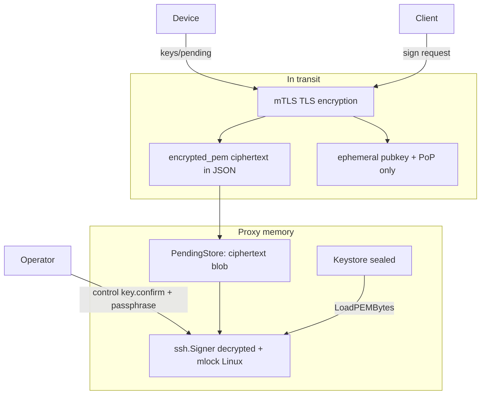

# Key protection: transport and proxy memory

Technical reference for how cryptographic keys and key material are protected in transit and while held by `luna-proxy`.

**Related:** [mtls-architecture.md](mtls-architecture.md) (network layer), [AGENTS.md](../AGENTS.md) (security rules), [2026-05-31-proxy-cli-keystore-design.md](superpowers/specs/2026-05-31-proxy-cli-keystore-design.md) (pending upload / control socket).

**Status:** Reference document (2026-05-31).

---

## 1. Three kinds of “keys”

The control plane centers on `proxy/internal/keystore` (sealed gate, passphrase unseal, mlock on Linux). Three distinct materials follow different rules:

| Kind | Where it lives | Transport | In proxy RAM |
|------|----------------|-----------|--------------|
| **Signing keys** (CA / host SSH) | Encrypted PEM on disk | mTLS HTTPS (mobile pending) or local path (control socket) | Decrypted `ssh.Signer` after unseal |
| **Pending upload blobs** | Device-held ciphertext | mTLS + base64 JSON | Ciphertext only until `key.confirm` |
| **Ephemeral client keys** | SDK / `luna-agent` only | Public key + PoP in sign JSON | **Not** stored in proxy |

---

## 2. Protection during transport

### 2.1 HTTPS API (mTLS)

Sensitive HTTP routes (`POST /api/v1/ssh/sign`, `GET .../wait`, mobile approve/pending, etc.) use **TLS 1.2+ with mutual TLS**:

| Mechanism | Location | Effect |
|-----------|----------|--------|
| TLS encryption | `proxy/internal/api/server.go`, `sdk/mtls.go` | JSON bodies are ciphertext on the wire |
| Server auth | Client `LUNA_MTLS_CA` | Clients reject a fake proxy |
| Client auth | `withMTLS`, client CA pool | Only enrolled client certs reach signing APIs |
| Session HMAC | `proxy/internal/auth/hmac.go`, `sdk/sign/hmac.go` | `X-Luna-Body-Mac` binds body to this TLS session; cross-session replay fails |

See [mtls-architecture.md](mtls-architecture.md) for the full mTLS and auth-pipeline story.

### 2.2 Mobile encrypted key upload

`POST /api/v1/mobile/keys/pending` (`proxy/internal/api/keys_pending_handler.go`):

- Request body capped at **64 KiB** (`maxPendingKeyBody`).
- `encrypted_pem` is **base64-encoded, passphrase-protected OpenSSH PEM** — the proxy **does not decrypt on upload**.
- Requires **enrolled device mTLS** plus Ed25519 signature over a canonical payload (`proxy/internal/api/device_auth.go`).
- Automation / admin client certs are **rejected** for upload.

In transit: TLS encrypts HTTP; the payload remains **encrypted PEM**, not a plaintext private key.

### 2.3 Control socket (keystore load / confirm)

`luna-proxy key load` and `key.confirm` use a **Unix domain socket** (`proxy/internal/control`), not mTLS. Protection is **local**:

- Linux: peer credentials via `SO_PEERCRED` (`peer_linux.go`).
- Passphrase in JSON; server copies to `[]byte` and `ZeroBytes` (`proxy/internal/control/ops.go`).
- CLI: `readPassphrase()` returns `[]byte`, deferred `ZeroBytes` (`proxy/cmd/luna-proxy/key.go`).

Trust boundary: same host and allowed UID/GID, not network TLS.

### 2.4 Ephemeral SSH keys (clients)

Per sign request, `sdk/sign/client.go` and `sdk/sign/signature.go` generate a fresh **ed25519** key pair. Only **public key** and **PoP signature** are sent to the proxy. The ephemeral **private key stays on the client** and signs the SSH challenge after the cert or hosted signature is returned.

---

## 3. Protection in proxy memory

### 3.1 Sealed gate

Until load/unseal, `Keystore` holds no decrypted signers (`ErrSealed`). `POST /api/v1/ssh/sign` returns **503** when sealed. Signing material exists in RAM only after successful `LoadPEMFile` / `LoadPEMBytes` or control `key.load` / `key.confirm`.

### 3.2 Load path: mlock, zero, ed25519-only

`LoadPEMBytes` (`proxy/internal/keystore/keystore.go`):

1. `mlockBytes` on PEM bytes and passphrase slice.
2. `parseEncryptedPEM` decrypts with `ssh.ParseRawPrivateKeyWithPassphrase`.
3. `zeroBytes` on PEM and passphrase after parse.
4. `mlockSigner` on the loaded `ssh.Signer`.

`parseEncryptedPEM`:

- **ed25519 only** — other key types return an error (no silent load of RSA/ECDSA).
- For `*ed25519.PrivateKey` from the parser: copy into an owned slice, zero the parser buffer, mlock the owned key, then build the signer.

**Linux** (`mlock_linux.go`): `unix.Mlock` on byte slices; `mlockSigner` uses reflection to mlock the ed25519 field inside the signer struct.

**Non-Linux** (`mlock_stub.go`): `zeroBytes` still runs; **mlock is a no-op** — swap exposure is higher on those platforms.

### 3.3 Long-lived signers in RAM

After load:

- **local-ca:** single `caSigner` in `Keystore`.
- **local-key:** `LocalKeyPool` keyed by fingerprint.

Signers remain in process memory (mlocked on Linux) until `key.remove` or process exit. v1 does **not** persist decrypted signing keys to disk.

### 3.4 Pending queue (ciphertext only)

`PendingStore` (`proxy/internal/keystore/pending.go`) stores a copy of the uploaded blob:

```go
Blob: append([]byte(nil), blob...),
```

- RAM holds **encrypted PEM**, not a parsed private key.
- **No mlock** on pending blobs.
- TTL **15 minutes**; caps: 32 global, 4 per device.
- Decryption only on `key.confirm` → `LoadPEMBytes(p.Blob, passphrase, …)` using the same mlock/zero path as file load.

### 3.5 Logging and secrets

Per `AGENTS.md`, never log: private keys, TLS exporter keys, passphrases, raw signatures. Sign audit logs use fingerprints and outcomes (`proxy/internal/api/sign_log.go`), not key material.

---

## 4. Data-flow diagram



---

## 5. Threat model limits

| Gap | Detail |
|-----|--------|
| **Swap / core dumps** | `mlock` reduces swap exposure on Linux; not an HSM. Non-Linux builds skip mlock. |
| **Passphrase via control JSON** | `json.Unmarshal` may leave a Go `string` until GC; the `[]byte` copy is zeroed. |
| **Pending blobs in RAM** | Ciphertext without mlock; process memory compromise could exfiltrate blobs (passphrase still required to decrypt). |
| **Stolen mTLS client cert** | Authenticates as automation identity; does not alone yield signing PEM or passphrase. |
| **Ephemeral client private key** | Never sent to proxy; protection is entirely on the client host. |

---

## 6. Code map

| Concern | Location |
|---------|----------|
| Keystore load / seal | `proxy/internal/keystore/keystore.go` |
| mlock / zero | `proxy/internal/keystore/mlock_linux.go`, `mlock_stub.go` |
| Pending ciphertext queue | `proxy/internal/keystore/pending.go` |
| Mobile upload handler | `proxy/internal/api/keys_pending_handler.go` |
| Control key load / confirm | `proxy/internal/control/ops.go` |
| CLI passphrase handling | `proxy/cmd/luna-proxy/key.go` |
| Ephemeral client keys | `sdk/sign/client.go`, `sdk/sign/signature.go` |
| mTLS transport | `sdk/mtls.go`, `proxy/internal/api/server.go` |

---

## 7. Summary

**Transport:** mTLS encrypts API traffic; mobile uploads send **encrypted PEM** inside TLS; control-socket passphrases stay on the local host; client signing keys are ephemeral and never uploaded as private material.

**Proxy memory:** Signing keys are **sealed until operator load**, decrypted only in RAM with **mlock + zero on load** (Linux), kept as **ssh.Signer** until removed; pending keys stay **ciphertext** until confirm. Layered with approval, PoP, and HMAC — not mTLS alone.
