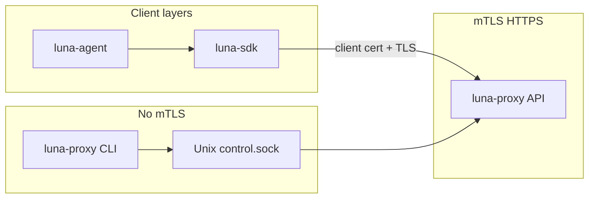
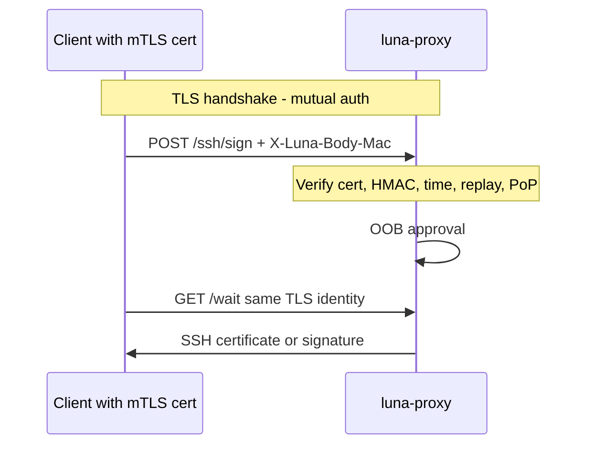

# mTLS in Luna Z-Trust

Technical reference for how mutual TLS is used across the stack, what it protects, and what it does not.

**Related specs:** [2026-05-21-luna-core-design.md](superpowers/specs/2026-05-21-luna-core-design.md) (auth pipeline), [AGENTS.md](../AGENTS.md) (auth order, security rules), [setup.md](setup.md) (certificate provisioning).

**Status:** Reference document (2026-05-31). Reflects the `feat/proxy-cli-keystore` architecture (HTTP admin unseal removed; control socket for keystore ops).

---

## 1. Role in the system

Luna Z-Trust gates SSH access through a self-hosted **luna-proxy**. Automation and agents call the proxy over **HTTPS with mutual TLS (mTLS)**: the client proves identity with a certificate issued by your internal CA, and the server proves identity with its own certificate.

mTLS is the **network front door**. It is not the only control: signing still requires the auth pipeline (HMAC, replay, PoP), OOB approval, and a sealed keystore unsealed via the **Unix control socket** (not mTLS HTTP).

### Architectural layers

| Layer | Components | mTLS? |
|-------|------------|-------|
| Client SDK | `sdk/mtls.go`, `sdk/sign/client.go` | Client presents cert to proxy |
| Client runtime | `luna-agent` (uses SDK) | Same |
| Control plane | `proxy/internal/api`, `proxy/internal/auth` | Server verifies client certs |
| Proxy CLI & control socket | `luna-proxy key`, `/run/luna/control.sock` | **No** — local peer credentials |

---

## 2. How it works

### 2.1 TLS configuration

**Clients** load material from `LUNA_MTLS_CERT`, `LUNA_MTLS_KEY`, `LUNA_MTLS_CA` via `sdk.LoadTLSConfig` (`sdk/mtls.go`). The sign HTTP client attaches the client certificate to every request.

**Server** (`proxy/internal/api/server.go` → `LoadTLSConfig`) loads:

- Server certificate and key (proxy identity)
- **Client CA** pool (`ClientCAs`) to verify peer certificates

The listener uses `ClientAuth: tls.VerifyClientCertIfGiven`. Application middleware on protected routes **requires** a verified peer certificate (`r.TLS.PeerCertificates`).

### 2.2 Route gates

| Middleware | Routes | Requirement |
|------------|--------|-------------|
| `withMTLS` | `POST /api/v1/ssh/sign`, `GET /api/v1/ssh/sign/{tx_id}/wait`, `GET /api/v1/capabilities`, `POST /api/v1/mobile/approve`, `POST /api/v1/mobile/keys/pending` | Valid client cert from internal CA |
| `withAdminMTLS` | `POST /api/v1/mobile/enroll`, `DELETE /api/v1/mobile/devices/{device_id}` | Client cert with admin OU (e.g. `luna-admin`) |
| *(none)* | `GET /healthz`, `POST /api/v1/telegram/webhook` | No client cert |

`withMTLS` rejects missing peer certs with `401`. `withAdminMTLS` additionally checks the certificate **Organizational Unit** (`proxy/internal/api/admin_handler.go`).

`GET /healthz` is intentionally outside mTLS so load balancers can probe without a client certificate.

Historical note: `POST /api/v1/admin/unseal` returned **410 Gone**; keystore unseal/load uses the control socket (`luna-proxy key load`), not mTLS HTTP.

### 2.3 Sign flow: mTLS is step 1 only

For `POST /api/v1/ssh/sign`, the strict order in `proxy/internal/auth/pipeline.go` is:

1. **mTLS** — client identity at TLS layer (`withMTLS` + valid peer cert)
2. **HMAC** — `X-Luna-Body-Mac` = HMAC-SHA256(raw body, TLS exporter key `luna-request-hmac`, 32 bytes) — binds the body to **this** TLS session (`proxy/internal/auth/hmac.go`)
3. **Timestamp** — ±30 seconds
4. **Replay LRU** — `SHA256(raw_body)`, 60s TTL → `409` on duplicate
5. **PoP** — verify `pop_signature` over `target_user:target_ip:timestamp` with ephemeral `public_key`
6. **Transaction** — create `tx_id`, enqueue approval (Telegram / mobile / dev bypass)

Auth failure → **no** `tx_id`, **no** Telegram notification.

The SDK computes the same HMAC on the same reused TLS connection (`sdk/sign/hmac.go`). A captured HTTP body cannot be replayed on a **new** TLS session without the exporter secret from that handshake.

Additional bindings after auth:

- **Client cert fingerprint** stored on the transaction; `GET .../wait` must use the same mTLS identity.
- **`source-address`** on issued SSH certificates comes from the listener `RemoteAddr`, not `X-Forwarded-For` on that listener (unless a separate ingress is documented).

### 2.4 Mobile endpoints

`POST /api/v1/mobile/approve` and `POST /api/v1/mobile/keys/pending` require **enrolled device mTLS** (automation/admin certs rejected where applicable). They add an **Ed25519 device signature** over canonical JSON (`proxy/internal/api/device_auth.go`).

They do **not** use the sign pipeline HMAC or replay LRU. Replay resistance there is timestamp window + device signature semantics, not body HMAC.

### 2.5 Sequence (sign + wait)

---

## 3. Threat model: what mTLS protects

### 3.1 Protected well

| Threat | Mechanism |
|--------|-----------|
| **Passive eavesdropping** | TLS 1.2+ encrypts HTTP bodies (sign JSON, wait responses, mobile uploads). Network observers see ciphertext, not passphrases or key material in cleartext HTTP. |
| **Fake proxy (MITM to client)** | Client validates server cert against `LUNA_MTLS_CA`. Attacker needs a server cert trusted by the client. |
| **Unenrolled callers on signing API** | Without a private key for a cert issued by your client CA, TLS client auth fails or middleware returns 401. No global API keys in v1. |
| **Cross-session replay of sign bodies** | mTLS alone is insufficient; **HMAC + replay LRU + PoP** bind requests to session, time, and ephemeral key possession. |

### 3.2 Not solved by mTLS alone

| Risk | Notes |
|------|--------|
| **Signing keys at rest** | Encrypted PEM; unseal via **control socket** (peer cred on Linux), not mTLS HTTP. |
| **Stolen client cert + key files** | Possession of `LUNA_MTLS_KEY` (and cert) authenticates as that automation identity until revocation. mTLS is possession-based, not HSM-bound. |
| **Admin client cert compromise** | Admin OU can enroll/revoke mobile devices; cannot unseal via HTTP (control socket only). |
| **Mobile replay within ~30s** | Device Ed25519 + timestamp; no sign-pipeline replay LRU on those routes. |
| **Telegram webhook** | Validated by webhook secret, not mTLS. |
| **Local agent socket** | `LUNA_AGENT_SOCKET` / `/run/luna/agent.sock` uses Unix permissions and peer policy, not TLS. |
| **TLS exporter / MAC keys in logs** | Must never be logged (see AGENTS.md). |

---

## 4. Code map

| Concern | Location |
|---------|----------|
| Client TLS load | `sdk/mtls.go` |
| Sign HTTP + HMAC | `sdk/sign/client.go`, `sdk/sign/hmac.go` |
| Server TLS + middleware | `proxy/internal/api/server.go` |
| Admin OU check | `proxy/internal/api/admin_handler.go` |
| Auth pipeline | `proxy/internal/auth/pipeline.go`, `hmac.go`, `pop.go`, `replay.go` |
| Sign handler | `proxy/internal/api/sign_handler.go` |
| Mobile device auth | `proxy/internal/api/device_auth.go`, `mobile_handler.go`, `keys_pending_handler.go` |
| Production CA path guard | `proxy/internal/config/mtls.go` |
| Agent env | `LUNA_MTLS_*` in `agent/config_load.go` |

---

## 5. Configuration reference

| Variable (client/agent) | Purpose |
|-------------------------|---------|
| `LUNA_MTLS_CERT` | Client certificate PEM path |
| `LUNA_MTLS_KEY` | Client private key PEM path |
| `LUNA_MTLS_CA` | CA bundle to verify proxy server cert |

| Variable (proxy) | Purpose |
|------------------|---------|
| `LUNA_MTLS_SERVER_CERT` / `LUNA_MTLS_SERVER_KEY` | Server identity |
| `LUNA_MTLS_CLIENT_CA` | CA used to verify client certificates |
| Admin client OU | Config field `admin_client_ou` (e.g. `luna-admin`) |

Test material: `testdata/ca/` (see `make testdata` when available).

---

## 6. Summary

**mTLS** establishes encrypted transport and **which enrolled client** is calling the proxy. **HMAC, replay protection, PoP, approval, and sealed keystore** provide the rest of zero-trust signing. Treat client TLS key files as high-value secrets; protect the control socket and signing PEM separately from network TLS identity.
