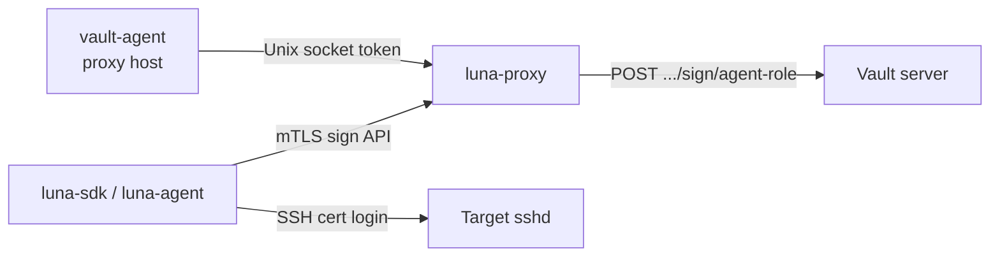

# Luna Z-Trust — Infrastructure Setup

Application build, mTLS, Telegram, and proxy env vars are in [README.md](../README.md). **Self-hosted signing** (encrypted key, admin unseal, target CA trust) is the default path — see [self-hosted central design](superpowers/specs/2026-05-30-self-hosted-central-design.md).

## Self-hosted central (current)

| Step | Action |
|------|--------|
| 1 | Generate or import an SSH CA (or host) key; store **encrypted PEM** at `LUNA_KEY_PATH` |
| 2 | Set `LUNA_SIGNER_MODE=local-ca` (or `local-key` for hosted-key agent signing) |
| 3 | Start `luna-proxy serve` (sealed); load key via control socket (`luna-proxy key load`) — see [deploy.md](deploy.md) |
| 4 | On targets, set `TrustedUserCAKeys` to the CA **public** key (for `local-ca`) |
| 5 | Issue automation client mTLS certs; configure Telegram webhook for production |

Test material: `make testdata` → `testdata/ca/` (mTLS), `testdata/ssh/encrypted_ca.key` (passphrase `test-pass`).

---

## Legacy: HashiCorp Vault

The sections below describe the **deprecated** Vault + `vault-agent` integration. New deployments should use the self-hosted path and [legacy-vault-migration.md](legacy-vault-migration.md).

## Overview (Vault)


| Layer         | Component                | Purpose                                                                       |
| ------------- | ------------------------ | ----------------------------------------------------------------------------- |
| Control plane | Vault SSH secrets engine | Signs short-lived SSH **user** certificates                                   |
| Control plane | vault-agent (proxy host) | AppRole auto-auth; delivers Vault API token to `luna-proxy`                   |
| Control plane | luna-proxy               | OOB approval, calls Vault sign API with `source-address`                      |
| Target        | `sshd`                   | Trusts the Vault SSH CA public key; validates principals and critical options |





**Defaults in this repository** (override with env vars on `luna-proxy`):


| Setting          | Default                                    |
| ---------------- | ------------------------------------------ |
| SSH engine mount | `ssh-agent-signer`                         |
| Sign role        | `agent-role`                               |
| Sign API path    | `/v1/ssh-agent-signer/sign/agent-role`     |
| Certificate TTL  | 5 minutes (E2E script; tune in production) |


---

## Prerequisites

- HashiCorp Vault 1.15+ (HA cluster recommended for production)
- Linux proxy host (token handoff uses `SO_PEERCRED`; see [proxy/internal/vault/token_linux.go](../proxy/internal/vault/token_linux.go))
- Vault CLI and admin access for one-time engine setup
- Target hosts running OpenSSH 7.4+ with certificate authentication enabled
- Network: proxy host → Vault API; clients → proxy (`:443` mTLS); clients → targets (`:22`)

---

## 1. Configure the Vault SSH secrets engine

Enable the SSH secrets engine on a dedicated mount path. The E2E script `[deploy/vault/ssh-ca-setup.sh](../deploy/vault/ssh-ca-setup.sh)` is the canonical minimal configuration; below is the same flow with production notes.

### 1.1 Enable the engine and generate the CA key

```bash
export VAULT_ADDR="https://vault.example.com:8200"
export VAULT_TOKEN="<admin-token>"

vault secrets enable -path=ssh-agent-signer ssh

# One-time: generate an internal CA key pair inside Vault
vault write ssh-agent-signer/config/ca generate_signing_key=true
```

Export the CA public key for target hosts (step 3):

```bash
vault read -field=public_key ssh-agent-signer/config/ca > luna-ssh-ca.pub
```

### 1.2 Create the signing role

`luna-proxy` signs **user** certificates via `POST /v1/ssh-agent-signer/sign/agent-role` with:

- `public_key` — ephemeral client key from the SDK
- `valid_principals` — SSH username (`target_user`)
- `critical_options.source-address` — client IP from the mTLS listener (enforced by OpenSSH on the target)

```bash
vault write ssh-agent-signer/roles/agent-role \
  key_type=ca \
  allow_user_certificates=true \
  allowed_users="root,deploy,ubuntu,ec2-user" \
  allowed_critical_options=source-address \
  ttl=5m \
  max_ttl=15m
```

Optional: set `default_extensions` (PTY, port-forwarding, etc.). The Vault CLI cannot pass maps as `key=value`, and `default_extensions=@file.json` still sends a **string** (the file body), which Vault rejects. Use one of these:

**stdin JSON** (`-` must be the only data argument — no other `key=value` pairs):

```bash
vault write ssh-agent-signer/roles/agent-role - <<'EOF'
{
  "key_type": "ca",
  "allow_user_certificates": true,
  "allowed_users": "root,deploy,ubuntu,ec2-user",
  "allowed_critical_options": "source-address",
  "default_extensions": { "permit-pty": "", "permit-port-forwarding": "" },
  "ttl": "5m",
  "max_ttl": "15m"
}
EOF
```

**Whole request from a file:**

```bash
cat > /tmp/luna-agent-role.json <<'EOF'
{
  "key_type": "ca",
  "allow_user_certificates": true,
  "allowed_users": "root,deploy,ubuntu,ec2-user",
  "allowed_critical_options": "source-address",
  "default_extensions": { "permit-pty": "", "permit-port-forwarding": "" },
  "ttl": "5m",
  "max_ttl": "15m"
}
EOF
vault write ssh-agent-signer/roles/agent-role @/tmp/luna-agent-role.json
```

| Field                      | Guidance                                                         |
| -------------------------- | ---------------------------------------------------------------- |
| `allowed_users`            | Restrict to principals you actually use; avoid `*` in production |
| `allowed_critical_options` | Must include `source-address` (required by Luna)                 |
| `ttl` / `max_ttl`          | Short TTL limits blast radius if a cert is stolen                |
| `default_extensions`       | JSON map via stdin `-` or `@full-role.json` only; field-level `@ext.json` is still a string |


### 1.3 Custom mount or role name

If you use a non-default mount or role, set on the proxy host:

```bash
export VAULT_SSH_MOUNT="my-ssh-mount"
export VAULT_SSH_ROLE="my-sign-role"
# Resolves to POST /v1/${VAULT_SSH_MOUNT}/sign/${VAULT_SSH_ROLE}
```

### 1.4 Vault policy for the proxy host identity

Create a policy that allows **only** signing on the agent role (no CA config, no key export):

```hcl
# luna-proxy-sign.hcl
path "ssh-agent-signer/sign/agent-role" {
  capabilities = ["create", "update"]
}
```

Apply and attach to the AppRole used by vault-agent (next section):

```bash
vault policy write luna-proxy-sign luna-proxy-sign.hcl
```

Optional read for operations (not required by `luna-proxy`):

```hcl
path "ssh-agent-signer/config/ca" {
  capabilities = ["read"]
}
```

### 1.5 Quick local verification

With a token that has the sign policy:

```bash
# Generate a throwaway Ed25519 key and sign it (example; real clients use luna-sdk)
ssh-keygen -t ed25519 -f /tmp/luna-test -N ""
vault write ssh-agent-signer/sign/agent-role \
  public_key="$(cat /tmp/luna-test.pub)" \
  valid_principals="deploy" \
  critical_options="source-address=10.0.0.1" \
  ttl=5m
```

---

## 2. AppRole and vault-agent auto-auth (proxy host)

`luna-proxy` does **not** store a long-lived Vault token on disk. On Linux it reads a short-lived token from a **Unix domain socket** (`VAULT_AGENT_SOCKET`) and verifies the connecting process UID (`VAULT_AGENT_UID`) via `SO_PEERCRED`.

### 2.1 Create AppRole for the proxy machine

```bash
vault auth enable approle    # skip if already enabled

vault write auth/approle/role/luna-proxy \
  token_policies="luna-proxy-sign" \
  token_ttl=1h \
  token_max_ttl=4h \
  secret_id_ttl=0 \
  secret_id_num_uses=0

vault read -field=role_id auth/approle/role/luna-proxy/role-id
# Store role_id on the host, e.g. /etc/vault/role-id (root:root 0400)
```

Provision **SecretID** using your org’s secure bootstrap (see [design-specification.md](design-specification.md) §II.1):

- Prefer **response wrapping** (`wrap_ttl=30s`, `wrap_max_uses=1`) for first boot
- Set `remove_secret_id_file_after_reading = true` in agent config so the file is deleted after first read

### 2.2 vault-agent configuration

Run vault-agent as **root** (or a dedicated high-privilege user). Run `luna-proxy` as an unprivileged user (e.g. `luna`); `VAULT_AGENT_UID` must be that user’s UID.

Example `/etc/vault/vault-agent.hcl`:

```hcl
pid_file = "/run/vault-agent.pid"

vault {
  address         = "https://vault.example.com:8200"
  ca_cert         = "/etc/vault/ca.pem"
  # tls_skip_verify = false   # never in production
}

auto_auth {
  method "approle" {
    mount_path = "auth/approle"
    config = {
      role_id_file_path                     = "/etc/vault/role-id"
      secret_id_file_path                   = "/etc/vault/secret-id"
      remove_secret_id_file_after_reading   = true
    }
  }

  sink "file" {
    config = {
      # Agent renews this file; token handoff server reads it (see below)
      path = "/run/vault/vault-token"
      mode = 0400
    }
  }
}
```

Enable and start the agent (systemd example):

```bash
sudo systemctl enable --now vault-agent
```

### 2.3 Token handoff socket (required by luna-proxy)

Stock vault-agent exposes the Vault API via an optional `listener` block; **luna-proxy v1** instead dials `VAULT_AGENT_SOCKET` and expects:

1. TCP-style stream on a Unix socket
2. Peer UID (via `SO_PEERCRED`) equals `VAULT_AGENT_UID`
3. Response body: Vault token string (optional trailing newline), then connection close

Deploy a small **root-owned** handoff service that:

- Listens on e.g. `/run/vault/luna-token.sock` (mode `0660` or `0600` with correct group)
- On each connection, reads the current token from the agent sink (e.g. `/run/vault/vault-token`) and writes it to the peer if UID matches

Example handoff script (illustrative — harden for production logging and error handling):

```bash
#!/bin/sh
# /usr/local/libexec/luna-vault-token-handoff.sh
set -eu
SOCKET="${LUNA_VAULT_SOCKET:-/run/vault/luna-token.sock}"
TOKEN_FILE="${VAULT_TOKEN_FILE:-/run/vault/vault-token}"
ALLOWED_UID="${VAULT_AGENT_UID:?set VAULT_AGENT_UID to luna-proxy user uid}"

rm -f "$SOCKET"
exec socat UNIX-LISTEN:"$SOCKET",fork,mode=0600 \
  SYSTEM:"grep -q . \"$TOKEN_FILE\" && head -c 65536 \"$TOKEN_FILE\" | tr -d '\\n' && echo"
```

Use a proper language binding with `SO_PEERCRED` checks in production instead of relying on `socat` alone.

**luna-proxy environment:**

```bash
export VAULT_AGENT_SOCKET=/run/vault/luna-token.sock
export VAULT_AGENT_UID=1001          # uid of the luna-proxy user
export LUNA_VAULT_ADDR=https://vault.example.com:8200
export VAULT_ADDR="$LUNA_VAULT_ADDR"
```

**Development only:** `LUNA_VAULT_TOKEN` bypasses the socket (used in [docker-compose.e2e.yml](../deploy/docker-compose.e2e.yml)); do not use in production.

### 2.4 Bootstrap checklist (proxy host)


| Step | Action                                                                          |
| ---- | ------------------------------------------------------------------------------- |
| 1    | Install vault-agent and `luna-proxy` binaries                                   |
| 2    | Place `role-id` and one-time `secret-id` (or wrapped token) under `/etc/vault/` |
| 3    | Start vault-agent; confirm `/run/vault/vault-token` updates on renew            |
| 4    | Start token handoff listener on `VAULT_AGENT_SOCKET`                            |
| 5    | Run `luna-proxy` as user matching `VAULT_AGENT_UID`                             |
| 6    | Confirm sign requests reach Vault (audit log / test sign in §1.5)               |


---

## 3. Configure target hosts (Vault SSH CA trust)

Each SSH target must trust the **same** CA public key Vault uses for signing (`ssh-agent-signer/config/ca`). Luna does not provision `sshd`; this is standard OpenSSH certificate authentication.

### 3.1 Install the CA public key

On every target:

```bash
sudo install -m 0644 -o root -g root luna-ssh-ca.pub /etc/ssh/luna_ca.pub
```

### 3.2 sshd configuration

Edit `/etc/ssh/sshd_config` (or a drop-in under `/etc/ssh/sshd_config.d/`):

```sshconfig
# Trust user certificates signed by the Vault SSH CA
TrustedUserCAKeys /etc/ssh/luna_ca.pub

# Required for certificate authentication
PubkeyAuthentication yes

# Optional: map principals to local users
# AuthorizedPrincipalsFile /etc/ssh/auth_principals/%u
```

Reload sshd:

```bash
sudo sshd -t && sudo systemctl reload sshd
```

### 3.3 Principals and `source-address`

- Luna sets `valid_principals` to the requested SSH username (`target_user`). If you use `AuthorizedPrincipalsFile`, list allowed names there.
- Luna sets critical option `source-address` to the client’s public IP as seen on the **mTLS listener**. The target `sshd` rejects connections from other source IPs even if the cert is valid.
- Ensure targets see the real client IP (avoid NAT that replaces the address with an unexpected one unless you intentionally sign for that address).

### 3.4 Verify login with a signed certificate

After `luna-proxy` signs a cert (via SDK E2E or production flow):

```bash
ssh -i <ephemeral-key> -o CertificateFile=<signed-cert.pub> deploy@target.example.com
```

Or use `luna-agent` with `SSH_AUTH_SOCK` pointing at `/run/luna/agent.sock` (see [README.md](../README.md)).

### 3.5 Hardening targets


| Topic       | Recommendation                                                                                                       |
| ----------- | -------------------------------------------------------------------------------------------------------------------- |
| Host keys   | Keep normal host key verification; Luna clients should not use `InsecureIgnoreHostKey` outside tests                 |
| CA rotation | Plan dual-trust during CA key rotation; distribute new `luna-ssh-ca.pub` before retiring old CA                      |
| Principals  | Prefer explicit `allowed_users` in Vault and `AuthorizedPrincipalsFile` on hosts                                     |
| TTL         | Match Vault role TTL to your session length; certs are not revocable like traditional SSH keys without extra tooling |


---

## 4. luna-proxy Vault-related environment summary


| Variable                          | Required     | Description                                   |
| --------------------------------- | ------------ | --------------------------------------------- |
| `LUNA_VAULT_ADDR` or `VAULT_ADDR` | Yes          | Vault API base URL                            |
| `VAULT_AGENT_SOCKET`              | Production   | Unix socket for token handoff                 |
| `VAULT_AGENT_UID`                 | With socket  | UID of the `luna-proxy` process               |
| `VAULT_SSH_MOUNT`                 | No           | SSH engine mount (default `ssh-agent-signer`) |
| `VAULT_SSH_ROLE`                  | No           | Role name (default `agent-role`)              |
| `LUNA_VAULT_TOKEN`                | Dev/E2E only | Static token; skips vault-agent               |


---

## 5. End-to-end stack in this repository

For a local smoke test without vault-agent or target `sshd`:

```bash
make testdata
make e2e-up      # Vault dev + ssh-ca-setup.sh + luna-proxy :8443
make e2e-test
make e2e-down
```

That path uses `LUNA_VAULT_TOKEN=root` and `LUNA_ENV=dev` (auto-approve). Production should use AppRole, token handoff, Telegram approval, and real target `sshd` as above.

---

## 6. Related documentation


| Document                                                                                             | Contents                                    |
| ---------------------------------------------------------------------------------------------------- | ------------------------------------------- |
| [README.md](../README.md)                                                                            | Components, mTLS, Telegram, agent env       |
| [design-specification.md](design-specification.md)                                                   | Wrapped SecretID bootstrap, zero-disk model |
| [superpowers/specs/2026-05-21-luna-core-design.md](superpowers/specs/2026-05-21-luna-core-design.md) | Sign API, auth pipeline, IP binding         |
| [deploy/vault/ssh-ca-setup.sh](../deploy/vault/ssh-ca-setup.sh)                                      | Idempotent Vault SSH CA for CI/E2E          |


